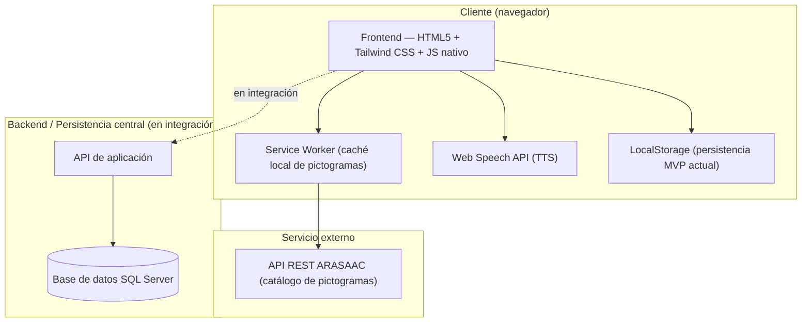

# Capstone TEA-yudo
Integrantes: Rolando Fierro, Carlos Peña y Cristóbal Ávila  

Plataforma web de comunicación aumentativa y bitácora de seguimiento profesional, desarrollada como Proyecto de Aplicación de Título (APT) — Ingeniería en Informática, Duoc UC, Sede San Joaquín.

## Descripción

**TEA-yudo** es una plataforma web que combina un **tablero de comunicación por pictogramas** (integrado con la API pública de [ARASAAC](https://arasaac.org/)) con un **sistema de bitácora y seguimiento profesional** para equipos de Programa de Integración Escolar (PIE).

**¿A quién va dirigido?**
- **Niños y niñas con Trastorno del Espectro Autista (TEA)** en establecimientos de educación pública, como usuarios directos del tablero de comunicación.
- **Equipos PIE, docentes y profesionales de apoyo** (psicopedagogos, fonoaudiólogos, etc.), como usuarios del módulo de bitácora, rutinas y seguimiento.
- **Apoderados**, con acceso de consulta al progreso y rutina de sus hijos.

**¿Qué problema resuelve?**
Hoy existe una brecha importante de herramientas digitales de apoyo e inclusión para estudiantes TEA en la educación pública: los equipos PIE cuentan con recursos limitados para registrar avances, gestionar rutinas diarias y facilitar la comunicación funcional de los estudiantes. TEA-yudo centraliza ambas necesidades — comunicación aumentativa y registro profesional — en una sola plataforma accesible, en lugar de depender de material físico disperso o registros manuales no estandarizados.

## Tecnologías utilizadas

| Categoría | Tecnología |
|---|---|
| **Frontend** | HTML5, Tailwind CSS, JavaScript nativo (vanilla JS) |
| **Accesibilidad / Comunicación** | Web Speech API (síntesis de voz / TTS) para la lectura en voz alta de las frases construidas con pictogramas |
| **Integración externa** | API REST de [ARASAAC](https://arasaac.org/) (catálogo de pictogramas), consumida mediante cliente HTTP con **Service Worker** para caché local (mitiga caídas o latencia de la API externa) |
| **Persistencia (estado actual)** | LocalStorage del navegador (guardado automático de interacciones y bitácora en el MVP actual) |
| **Base de datos (destino final)** | SQL Server — modelo relacional ya definido (ver `/docs` o el script `tea_yudo_sqlserver.sql`) |
| **Diseño / Prototipado** | Balsamiq, Figma (mockups y prototipo navegable de alta fidelidad, bajo estándares WCAG) |
| **Modelado de arquitectura y datos** | Diagramas C4 / UML, Modelo Entidad-Relación (notación Chen) |
| **Gestión de proyecto** | Tablero Kanban en JIRA |
| **Normativa considerada** | Ley 19.628 (Protección de Datos Personales), Decreto 170 (necesidades educativas especiales) |

> **Nota de estado:** a la fecha (Fase 2 del proyecto), la persistencia central en SQL Server y las medidas de seguridad (cifrado, control de acceso por PIN/roles) están **en curso** — el MVP actual funciona con almacenamiento local mientras se consolida la integración con la base de datos central.

## Instrucciones para ejecutar el proyecto localmente

> El frontend actual funciona como aplicación web estática (sin build obligatorio), por lo que puede levantarse sin backend para explorar el tablero de pictogramas y la bitácora en modo local (LocalStorage).

1. **Clonar el repositorio**
   ```bash
   git clone https://github.com/<usuario-o-equipo>/tea-yudo.git
   cd tea-yudo
   ```

2. **Servir el frontend localmente**
   No requiere `npm install` para la vista estática. Puedes usar cualquier servidor local simple, por ejemplo:
   ```bash
   npx live-server ./src
   ```
   o con Python:
   ```bash
   python3 -m http.server 5500 --directory ./src
   ```
   Luego abre `http://localhost:5500` en el navegador.

3. **(Opcional) Preparar la base de datos SQL Server**, cuando se trabaje contra persistencia central en lugar de LocalStorage:
   ```bash
   sqlcmd -S <servidor> -i tea_yudo_sqlserver.sql
   ```
   Esto crea la base de datos `TEA_yudo` con las 12 tablas del modelo relacional. Para revertir:
   ```bash
   sqlcmd -S <servidor> -i tea_yudo_sqlserver_drop.sql
   ```

4. **Variables de configuración**
   Si tu copia del proyecto ya integra el backend de persistencia central, define en un archivo `.env` (no versionado):
   ```
   ARASAAC_API_URL=https://api.arasaac.org/v1
   DB_CONNECTION_STRING=<cadena de conexión a SQL Server>
   ```

5. **Verificar la caché de pictogramas**
   La primera carga descarga el catálogo de ARASAAC y lo persiste vía Service Worker; si trabajas sin conexión luego de la primera carga, los pictogramas ya visitados seguirán disponibles.

## Integrantes del equipo y roles

| Integrante | Rol principal |
|---|---|
| **Cristóbal Ávila** | Diseño UI/UX, mockups y prototipo navegable (Balsamiq/Figma); desarrollo Frontend (HTML5, Tailwind, JS) e integración de Web Speech API |
| **Carlos Peña** | Modelamiento de arquitectura y datos; desarrollo backend y persistencia (bitácora, base de datos); integración de la API de ARASAAC |
| **Rolando Fierro** | Modelamiento de arquitectura y datos (junto a Carlos); aseguramiento de calidad (QA) y diseño de casos de prueba; implementación de medidas de seguridad (junto a Carlos) |

## Metodología de trabajo del equipo

El equipo trabaja bajo una metodología ágil basada en **Scrum**, gestionada en un tablero **JIRA** con tareas divididas por área técnica (Frontend, Backend/Datos, QA).

Debido a la incompatibilidad de horarios por responsabilidades laborales de los integrantes, se adoptó un esquema de **trabajo asíncrono con metas individuales** registradas en el tablero, complementado con **reuniones de integración sincrónicas fuera del horario laboral** para consolidar avances y resolver bloqueos en conjunto.

El alcance se acotó desde el inicio a un **Producto Mínimo Viable (MVP)**, lo que ha evitado ajustes estructurales al plan de trabajo original definido en la Fase 1 (Carta Gantt de 18 semanas).

## Arquitectura de la solución

Arquitectura en capas, con separación entre la interfaz, la lógica de comunicación/pictogramas y la persistencia:



- **Capa de presentación**: interfaz web accesible (WCAG) que aloja el tablero de pictogramas (vista niño) y el panel de bitácora/rutinas (vista profesional PIE).
- **Capa de comunicación externa**: cliente HTTP hacia la API de ARASAAC, con Service Worker que cachea el catálogo localmente para tolerar caídas o latencia del servicio externo.
- **Capa de persistencia**: actualmente LocalStorage para el MVP (guardado automático de interacciones y bitácora); en integración la migración a la base de datos central en SQL Server, cuyo Modelo Entidad-Relación y modelo relacional ya están definidos.
- **Seguridad** (pendiente de cierre): cifrado de datos sensibles y control de acceso por PIN/roles, alineado a la Ley 19.628, a implementarse una vez consolidada la persistencia central.

## Estado actual del proyecto (Fase 2)

| Módulo | Estado |
|---|---|
| Mockups e interfaz de usuario (UI/UX) | ✅ Completado |
| Integración API ARASAAC | ✅ Completado |
| Modelo de arquitectura y datos | ✅ Completado |
| Desarrollo Frontend | 🔄 En curso (falta afinar responsividad en tablets de gama baja) |
| Backend y persistencia central | 🔄 En curso (LocalStorage activo, falta vincular con BD central) |
| Seguridad de la información | ⏳ No iniciado (planificado tras cerrar persistencia) |
| Aseguramiento de calidad (QA) | ⏳ No iniciado (casos de prueba en preparación) |

